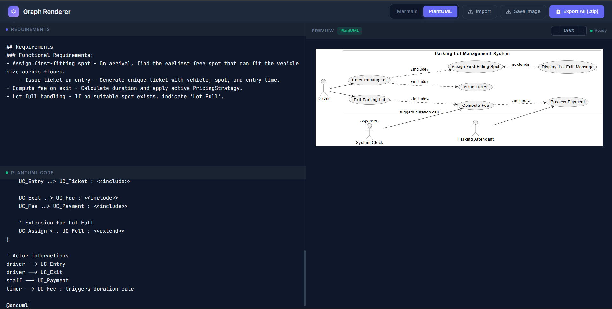

# Graph Renderer ⬡

A high-performance, single-page diagramming tool for turning text into visual architecture. Built to support both **Mermaid** and **PlantUML** with a sleek, developer-centric interface.

 
## ✨ Features

- **Multi-Engine Rendering**: Seamlessly toggle between Mermaid (client-side) and PlantUML (server-side).
- **Triple-View Layout**:
  - **Requirements**: A dedicated space for specs, notes, or logic.
  - **Code Editor**: Monospace editor for diagram syntax.
  - **Live Preview**: Real-time rendering as you type.
- **Interactive Preview**:
  - **Zoom & Pan**: Smooth zoom controls (+/- or Ctrl+Scroll) and drag-to-pan to inspect large, complex diagrams.
  - **Reset**: Instantly snap back to 100% and center focus.
- **Smart Exports**:
  - **Save Image**: Export the current diagram as a high-resolution PNG.
  - **Export All (.zip)**: Bundle your `requirements.md`, diagram source code, and rendered PNG into a single package.
- **Persistence**: Automatically saves your session state to `localStorage`.
- **CI/CD Ready**: Integrated GitHub Actions for automatic deployment to GitHub Pages.

## 🚀 Tech Stack

- **Core**: [React 19](https://react.dev/) + [Vite 6](https://vitejs.dev/)
- **Styling**: [Tailwind CSS v4](https://tailwindcss.com/)
- **Diagramming**: [Mermaid.js](https://mermaid.js.org/) & [PlantUML](https://plantuml.com/)
- **Utilities**: [Pako](https://github.com/nodeca/pako) (compression), [JSZip](https://stuk.github.io/jszip/) (exporting)
- **Deployment**: [GitHub Actions](https://github.com/features/actions)

## 🛠️ Getting Started

### Prerequisites

- [Node.js](https://nodejs.org/) (v20 or higher recommended)
- [npm](https://www.npmjs.com/)

### Installation

1. Clone the repository:
   ```bash
   git clone https://github.com/JosephPham324/graph-renderer.git
   cd graph-renderer
   ```

2. Install dependencies:
   ```bash
   npm install
   ```

3. Start the development server:
   ```bash
   npm run dev
   ```

## 📦 Deployment

This project is configured for **GitHub Pages** via GitHub Actions.

1. Push your code to the `main` branch.
2. In your GitHub repository, go to **Settings > Pages**.
3. Under **Build and deployment > Source**, select **GitHub Actions**.
4. The `.github/workflows/deploy.yml` will automatically build and deploy the app.

---
Built by Joseph Pham
